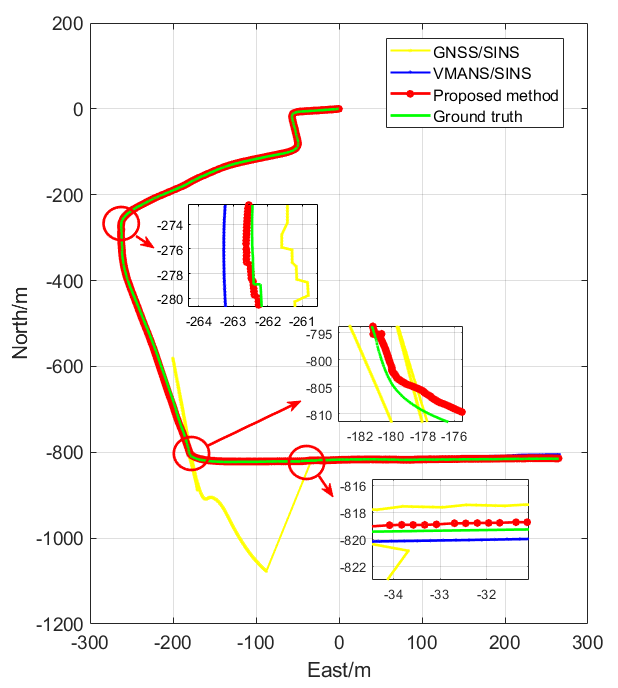

## About Me

My name is Chaoyang Zhai. I am a student pursuing my M.S degree in Control Science and Engineering at Beijing Institute of Technology.

## Reaserch Interests

Autonomous Driving, Robotics, Vision-aided Inertial Navigation System, Multi-source Information Fusion

## Publications

#### A Robust Vision-Aided Inertial Navigation System for Unmanned Ground Vehicle Considering Camera Vibrations.

#### An Integrated System Using Federated Kalman Filter for UGV Navigation in GNSS-denied Environment. Chinese Control Conference, 2019.[[PDF]](https://www.sci-hub.shop/10.23919/chicc.2019.8865416)

    
    An Integrated System Using Federated Kalman Filter for UGV Navigation in GNSS-denied Environment. Chinese Control Conference, 2019. 

For more details see [[PDF]](https://www.sci-hub.shop/10.23919/chicc.2019.8865416)

## Awards

### 2019   

National Scholarship: **Top 2% in BIT**

IEEE CSS Beijing Chapter Young Author Award Nomination

### 2018

Unmanned Ground System Challenge: Air-ground Synergy Group: **National First Prize**
